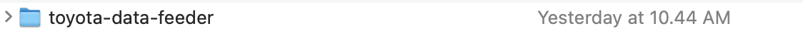
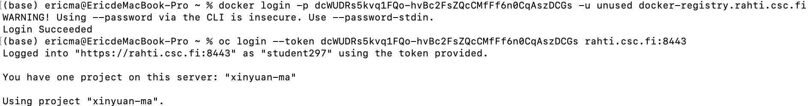
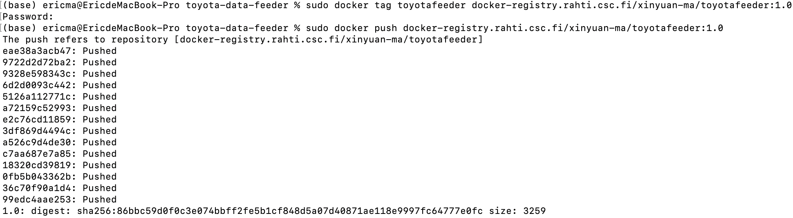
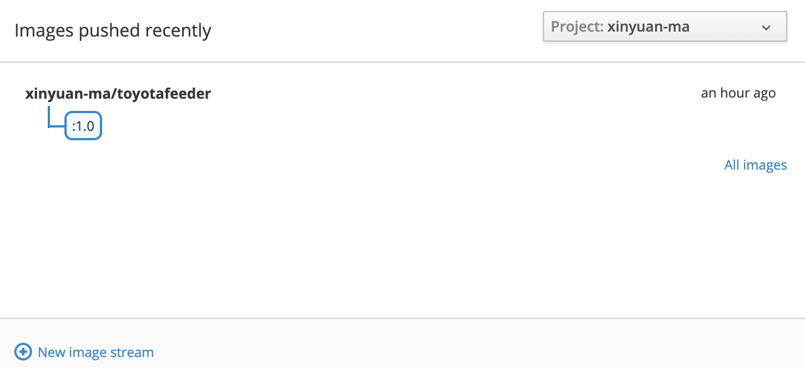
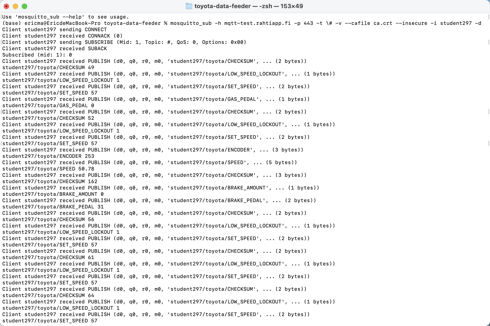
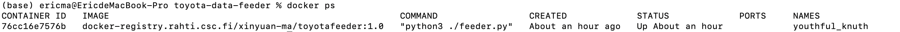

# SDS
Software-Defined Systems

## exercise 1
### Hints
1. Check the toyota-data-feeder repository
2. Create a Dockerfile that executes feeder.py on container startup  
   Only include files that are actually needed for the application to run  
   For example, be sure to not include /assets folder in your image
3. Build the image and push it to the registry  
   You can use either DockerHub or CSC Rahti registry, but we recommend the latter.  
   If you are using CSC Rahti registry, be sure to assign assistants to your project and to change image pull policy to Anonymous. Check exercise 1 slides for more.  
   Tag the image with 1.0 tag
4. Run the image with correct MQTT_URL, MQTT_PORT  and CLIENT_ID values  
   Don't hardcode these values!
6. Use mosquitto_sub to confirm you are receiving messages from your Docker container  
   Use flags --verbose --insecure and --cafile ca.crt. Get ca.crt and other certificates from exercises page.
6. Execute a command which lists working directory's files of the running container  (that directory where you copied application files in step 2)

### Deliverables
1. Dockerfile, and other files if needed.
2. Small text report with the commands and outputs of each step (except step 2)  
   Include your name and CSC Rahti account name in this text file  
   Please, don't copy-paste the whole output when data is being sent/received, just a small snippet. (Steps 4,5)
    
  
  
### My Text Report
#### INFO:
   My name: Xinyuan Ma  
   CSC Rahti account: student297


#### STEPS:
1. Open [toyota-data-feeder](https://github.com/smaddis/toyota-data-feeder) to download the zip and unzip it 
2. Create a [Dockerfile](materials-of-sds-exe1/Dockerfile)
3. Build the image:
   ``` Dockerfile
       
      FROM python:3.9
      # add a line in our Dockerfile that tells Docker what base image we would like to use for our application.
      
      ADD feeder.py .
      
      COPY requirements.txt requirements.txt
      
      COPY ca.crt ca.crt
      
      COPY toyota_data.csv toyota_data.csv
      # add feeder.py, requirements.txt, ca.crt, toyota_data.csv in out working directory.
      
      RUN pip3 install -r requirements.txt
      # tell Docker to use pip3 to install requirements what python file needs.
      
      CMD ["python3", "./feeder.py"]
      # tell Docker what command we want to run when our image is executed inside a container.
   ```
   Push the image to the registry:
   ``` sh
      docker login -p dcWUDRs5kvq1FQo-hvBc2FsZQcCMfFf6n0CqAszDCGs -u unused docker-registry.rahti.csc.fi
      # login rahti
      oc login --token dcWUDRs5kvq1FQo-hvBc2FsZQcCMfFf6n0CqAszDCGs rahti.csc.fi:8443
      # login oc
      docker build -t toyotafeeder .
      # Build image named toyatafeeder
      sudo docker tag toyotafeeder docker-registry.rahti.csc.fi/xinyuan-ma/toyotafeeder:1.0
      # tag your toyatafeeder with 1.0 tag
      sudo docker push docker-registry.rahti.csc.fi/xinyuan-ma/toyotafeeder:1.0
      # push it to registry
      
   ```
   Results:
     
     
     
     INFO in Rahti:
     


4. Run the image:
   ```sh
   docker run --env MQTT_URL=mqtt-test.rahtiapp.fi --env MQTT_PORT=443 --env CLIENT_ID=student297 docker-   registry.rahti.csc.fi/xinyuan-ma/toyotafeeder:1.0
   ```
   
5. Use mosquitto_sub:
   ```sh
   mosquitto_sub -h mqtt-test.rahtiapp.fi -p 443 -t 'student297/#' -v --cafile ca.crt --insecure -i student297 -d
   ```
   
   Results:
   
   
6. Execute a command:
   ```sh
   docker ps
   ```
   
   Results:
   
   
   
   
   
   
#STINT
   ``` sh
   history 1 > out.txt
   # output history from line1 to the end and save it to out.txt
   
   mosquitto_sub -h mqtt-test.rahtiapp.fi -t \# -d -p 443
   # subscribe all topics
   ```
   [mosquitto_sub and mosquitto_pub function](http://www.steves-internet-guide.com/mosquitto_pub-sub-clients/)
